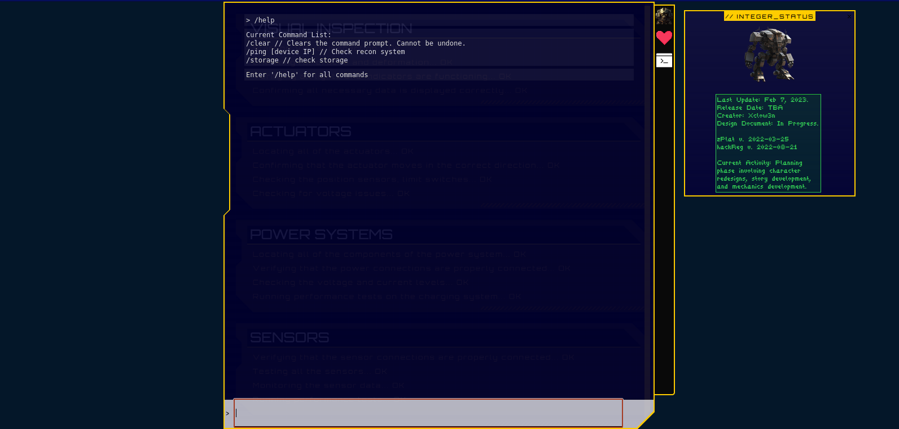
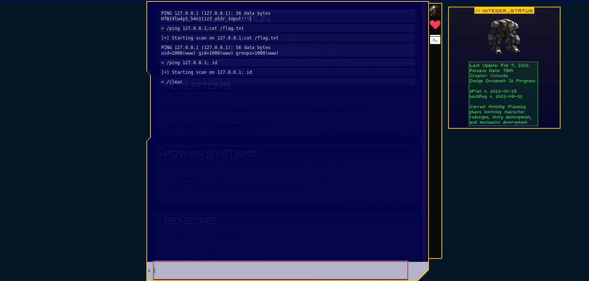
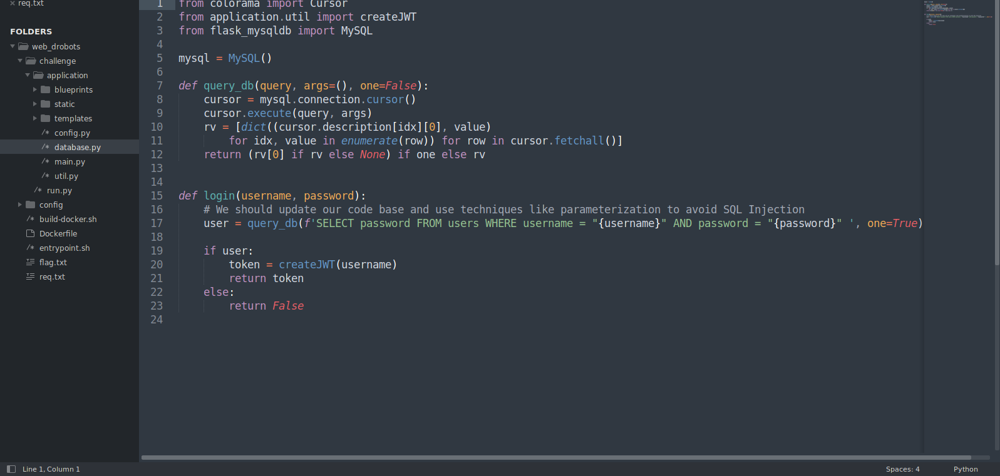
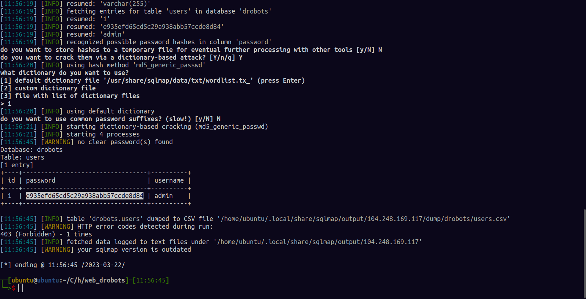
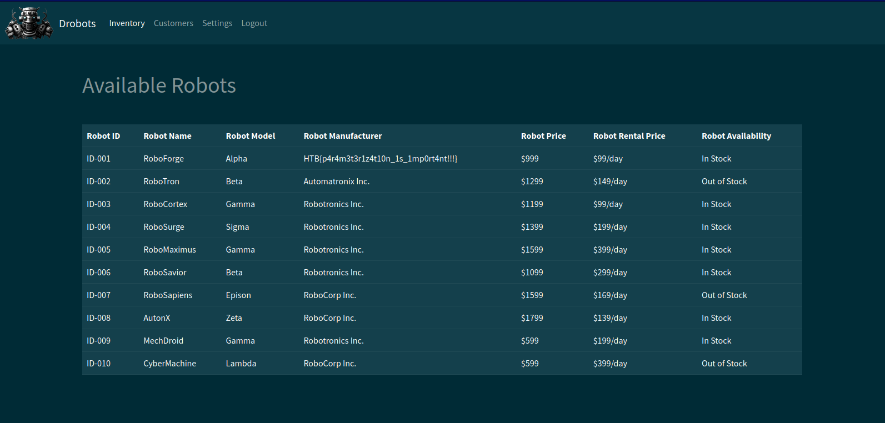
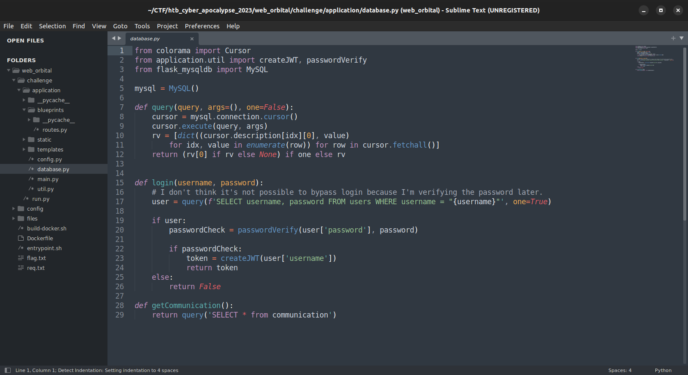
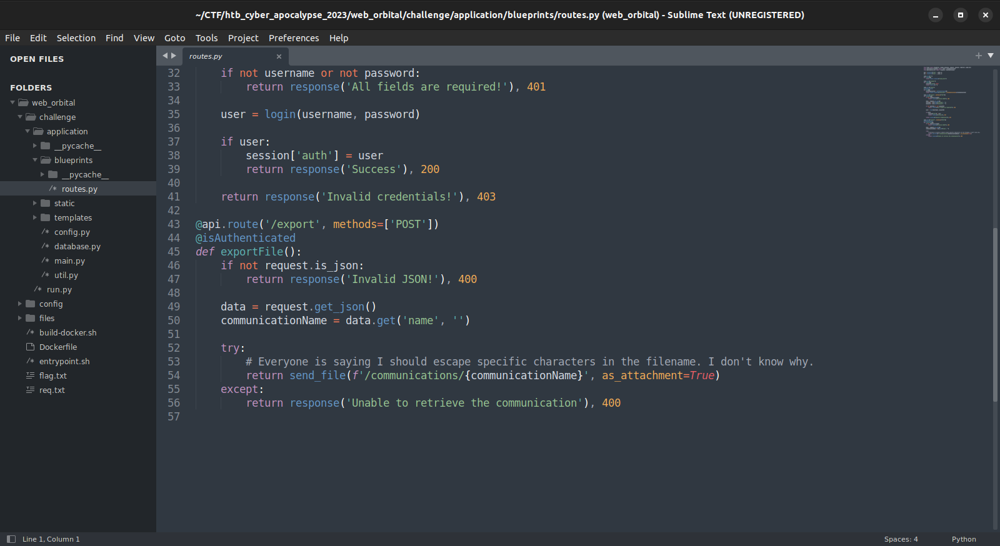
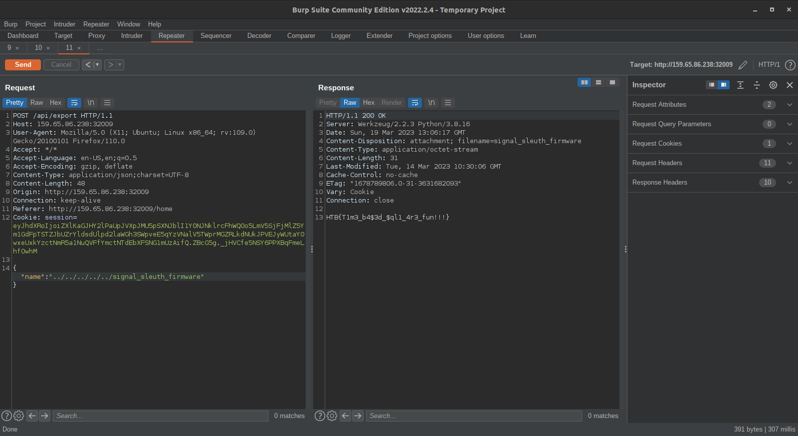

# htb-cyberapocalypse-2023-writeup
hackthebox cyberapocalypse 2023 the cursed mission

credits: p3rf3ctr00t_ke and gang de simphonia members

## gunhead

category: web
difficulty: very easy

When the docker is spawned , we are met with a rather interesting interface , what caught my eye was the command console

we can see that we can run the ping command, when i saw this i blindly ran /ping 127.0.0.1; id and it worked, boom command injection. Tbh i didnt even unzip the challenge source ;)

to read the flag we have to type /ping 127.0.0.1;cat flag.txt , very easy right :)

## passman

difficulty: easy
category: web

After starting the docker we are greeted with alogin page , we have to register and then login, this challenge comes with downloadable source code.In the source we find out that to get the flag we have to read a note generated by the admin notes as shown below

Looking through the source code we find out that the Updatepassword field will be our point of entry

the username and password will be read from our request so we can use this to change the admin password and be able to login as admin. To generate the payload i chatgpteed (haha) the payload.

i changed the password of admin to 1234

logging in  the flag is as shown below :)

## didactic otto paddles

difficulty: medium
category: web

This challenge cant deny it was a little tricky, the solution was simple but the enemy was over thinking

When the docker is spawned you are met witha a login page , if you look through the source code you will find the /register page , so lets register a user test we login in and are met by a  online-shop kinda interface

at this point i thought it had to be something about idor on the carts or items in the cart. :)

after alot of struggle we found out that  there was a 'none'  vulnerability in jwt that could  enable us to bypass jwt token signature verification and login as admin, of course by changing uid in jwt data. Credit @Inv1s1bl3.

link to a more detailed explanation [here](https://blog.pentesteracademy.com/hacking-jwt-tokens-the-none-algorithm-67c14bb15771)

so we just have to capture our jwt token and manipulate the uid to 1 for admin and change the alg to 'None' , mind the case since 'none' for some reason doesnt work.

replace the cookie in the browser storage with the one above and visit /admin page , it will allow access.

at this point we already had an ssti payload that we could use aganist jsrender on the admin page to cat the flag.txt.

{{:"pwnd".toString.constructor.call({},"return global.process.mainModule.constructor._load('child_process').execSync('cat /flag.txt').toString()")()}}

we will register a user using this payload as the username and a random password , then we refresh the admin page 

 

## drobots

difficulty: very easy
category: web

When the docker is spawned we get a login page , lookin through the source we get the comment , it is a clear clue of what we are up aganist, p.s the user input is passed directly into the sql statement which is very lethal

we fire up sqlmap and the results are below:

sqlmap -r req.txt --batch -D drobots -T users --dump  >>>  the datbase is called drobots and then we dump data from the table users 

the contents of req.txt

POST /api/login HTTP/1.1
Host: 104.248.169.117:32344
User-Agent: Mozilla/5.0 (X11; Ubuntu; Linux x86_64; rv:109.0) Gecko/20100101 Firefox/110.0
Accept: */*
Accept-Language: en-US,en;q=0.5
Accept-Encoding: gzip, deflate
Referer: http://104.248.169.117:32344/
Content-Type: application/json
Content-Length: 34
Origin: http://104.248.169.117:32344/
Connection: close

{"username":"test","password":"test"}

we login with the creds and we find the flag 

## orbital

category: web
difficulty: easy

When th docker is spawned we are met with a login page , looking through the source code we notice that the username is passed directly to the ql statement , if you are a fan of sqli you should know that this is very dangerous.

At this point we leave all the work to sqlmap :)

as you see above the admin password was strored in a hashed format that sqlmap was able to crack

admin:ichliebedich

we use this credentials to login to the webpage.

if you analysed the code carefully the /api/export function did not sanitize user input as it fetched files , we test lfi  be typing ../../../../../etc/passwd and it worked.

In the dockerfile we can see that the flag was renamed to signal_sleuth_firmware , we can just use it in the lfi , since it is stored in the rood dir (lfi: LOCAL FILE INCLUSION).

and we get the flag :)

## hijack

difficulty: very easy
category: misc

once you spawn the docker you get ana ip and port , use netcat to connect to the listening socket

it is a simple interface with create config , load config and exit . After playing around with it , i noticed that it generated a string , i tried decoding it using cyberchef as seen below

i had not this kind of syntax before so i googled it and it surns out it was yaml , then i came accross something called yaml deserialization attack.i found a github repo with a python code that can generate serialized yaml payload to perform the attack link is [Here](https://github.com/j0lt-github/python-deserialization-attack-payload-generator).

after generating the payload that does a simple id command i was able to read the flag.txt

the flag is shown above :)
